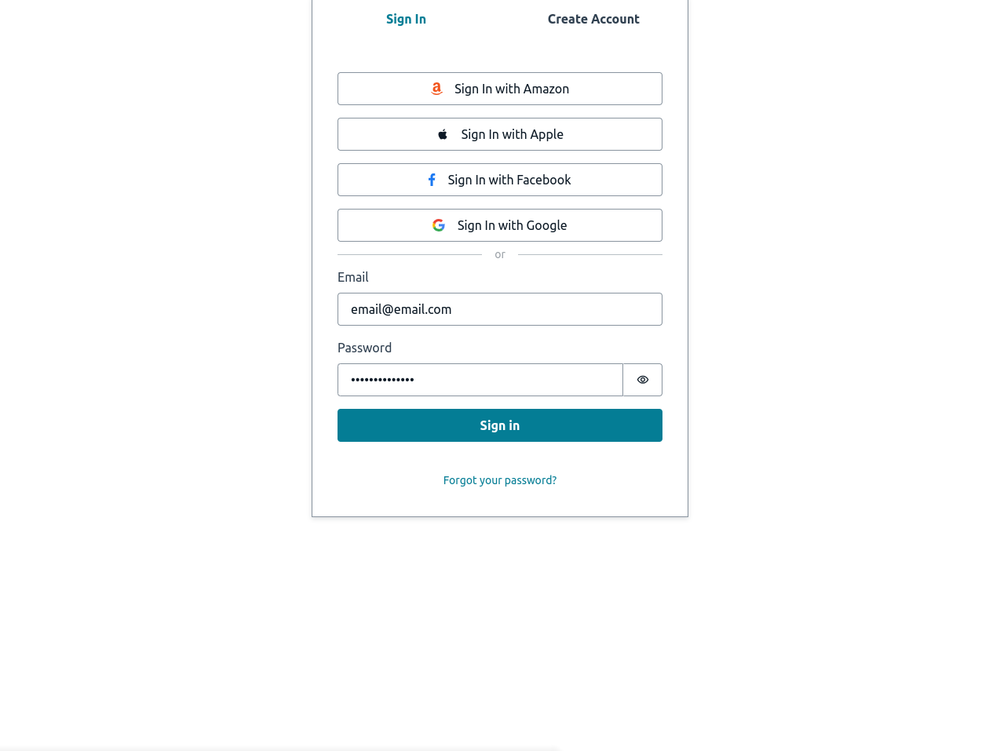

<h1 align="center">REACTJS - AMPLIFY</h1>

## About this Project

Simple project with Amplify integration - AWS Cognito following the official [documentation](https://docs.amplify.aws/gen1/javascript/tools/cli/start/set-up-cli/#configure-the-amplify-cli).

## Project presentation

## Used Techs

- aws-amplify: Set of tools and services provided by Amazon Web Services (AWS) that facilitate the creation and development of mobile and web applications.

# Author

Made with 💚 by Guilherme Bafica 👋

